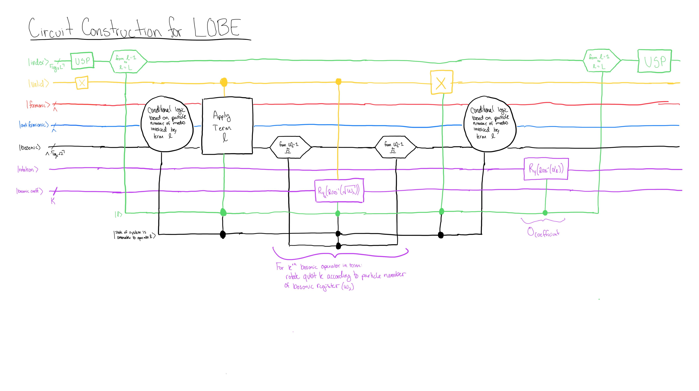
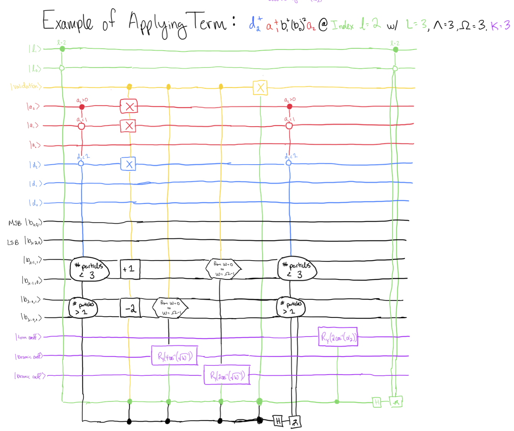

# (Generalized) Ladder Operator Block Encoding (LOBE)

This repository serves as a lightweight library to generate quantum circuits that create Block Encodings of Hamiltonians written as a sum of ladder operators.  

## Circuit Construction

Unlike in similar previous works on sparse block-encodings for ladder operators such as [this work by Liu et al.](https://arxiv.org/abs/2402.11205), LOBE uses primarily a single oracle. This singular oracle which is temporarily dubbed the Matrix Element oracle is comprised of several subroutines, some of which are dependent on the explicit structure of the operators in the Hamiltonian. 

The diagram above gives a sketch of the Matrix Element oracle for a general Hamiltonian that is assumed to be provided as a linear combination of ladder operators acting on fermions, antifermions, and bosons. It is also assumed that the coefficients of the terms all have magnitude less than one.

Glossary:
- $L$: The number of terms in the Hamiltonian.
- $\Lambda$: The number of momentum modes for the particles. Ex: a system with momentum modes of 0, 1, 2, and 3 would have $\Lambda = 4$.
- $\Omega$: The number of occupation states for each bosonic mode. Ex: a system that can store occupation numbers of 0, 1, 2, and 3 would have $\Omega = 4$.
- $K$: The maximum number of bosonic ladder operators within a single term in the Hamiltonian.

The registers in the circuit are as follows:
- Index: An ancilla register for the block-encoding. Each term in the Hamiltonian is associated with a single computational basis state of the index register.
- Validation: A single ancilla qubit that determines if the term fired for the given quantum state.
- Fermionic: The register storing the fermionic part of the system.
- Antifermionic: The register storing the antifermionic part of the system.
- Bosonic: The register storing the bosonic part of the system.
- Rotation: A single ancilla qubit that is used to encode the coefficients of the terms.
- Bosonic Coeff: A set of ancilla qubits that are used to encode the coefficients that are picked up when a state is hit by a bosonic ladder operator.

### DISCLAIMER

The license included under `src/lobe/_grover_rudolph/LICENSE` applies only with respect to the code under `src/lobe/_grover_rudolph/` and explicitly does not apply to the remaider of the code within this repository. This code comes directly from [this repository](https://github.com/qubrabench/grover-rudolph) courtesy of the QuBRA Benchmarking Project circa commit hash: `#454e4e52f1e97c0a63c7c3d04d722c8f953a6cde`. 